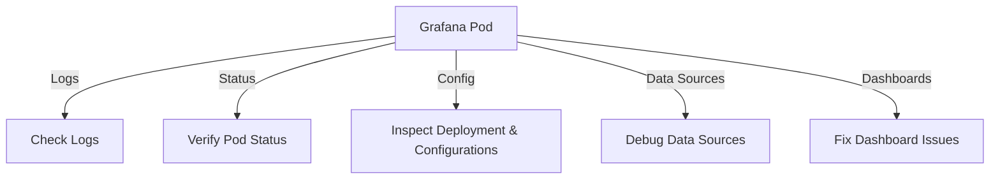

# Journey to Diagnose

## Architectural Diagram



## Terminal
- Commands

## 🚀 Debugging Grafana Bitnami Deployment in Kubernetes

**Namespace:** `grafana-monitoring`

### 1. 🔍 Check Grafana Logs

Start with the Grafana pod logs to find potential errors:

```sh
kubectl logs <grafana-pod-name> -n grafana-monitoring
```

Look for:
- ⚠️ errors
- 🔑 issues
- ❌ Data source connection

### 2. 🐳 Verify Pod Status

🔄 Check if the pod is running:

```sh
kubectl get pods -n grafana-monitoring
```

If the pod isn’t running:

```sh
kubectl describe pod <grafana-pod-name> -n grafana-monitoring
```

🔧 Restart the pod if needed:

```sh
kubectl delete pod <grafana-pod-name> -n grafana-monitoring
```

### 3. ⚙️ Inspect Deployment & Configurations

🔍 Check the deployment:

```sh
kubectl describe deployment grafana -n grafana-monitoring
```

📋 Review ConfigMap:

Ensure settings for dashboards, data sources, and environment variables are correct:

```sh
kubectl describe configmap <grafana-configmap-name> -n grafana-monitoring
```

💾 Check Persistent Volumes:

Ensure persistent storage is properly mounted:

```sh
kubectl get pvc -n grafana-monitoring
```

### 4. 🔗 Debug Data Sources

✅ Test data source connections:
1. Open Grafana UI
2. Navigate to Configuration > Data Sources
3. Test the connection status

🛠️ Fix connection issues:
- Check credentials 🗝️
- Verify network access 🔌
- Ensure the service is correctly configured in Kubernetes:

```sh
kubectl get svc -n grafana-monitoring
```

### 5. 📊 Fix Dashboard Issues

🛠️ Validate dashboard JSON files:
- Test importing your JSON files via the Grafana UI.
- Ensure JSON structure is valid.

🔐 Check permissions:
- Verify folder permissions in the UI.
- Check Kubernetes RBAC policies.

### 6. 🧩 Debug Plugins

📦 Verify installed plugins:

```sh
kubectl logs <grafana-pod-name> -n grafana-monitoring
```

## 🎨 Steps to Visualize in draw.io

### 1. Set the Diagram Layout
- Use a flowchart template to organize components systematically.
- Create swimlanes for each aspect of the deployment:
    - Kubernetes Cluster
    - Grafana Configuration
    - Data Sources
    - Monitoring and Debugging Tools

### 2. Add Key Components
For each component, use appropriate shapes and labels:
- Pods: Rounded rectangles or circles (e.g., “Grafana Pod”, “Data Source Pod”).
- Deployments: Use rectangles labeled “Bitnami Deployment”.
- ConfigMaps: Use document icons or smaller rectangles.
- Persistent Volumes: Use a cylinder shape labeled “PVC”.
- Network Services: Use a cloud or box labeled “Service” or “Ingress”.
- Dashboards: Use a monitor icon or simple rectangles with “Dashboard”.

### 3. Illustrate Debugging Flow
Represent the debugging tools and processes with arrows:
- Arrows pointing from pod to logs: “kubectl logs”.
- Arrows showing connections to ConfigMaps or Persistent Volumes.
- Highlight workflows, e.g., “Test Data Sources ➡️ Fix Network Issues”.

### 4. Group by Layers
Separate the diagram into layers:
- Kubernetes Cluster: Pods, Deployments, ConfigMaps, PVCs.
- Data Flow: Data sources connecting to Grafana.
- Debugging Tools: Highlight key kubectl commands and areas to investigate.

### 5. Add Color Coding and Icons
- Red: Error points or issues (e.g., broken connections).
- Green: Healthy components (e.g., active data sources).
- Use standard cloud/Kubernetes icons for clarity (e.g., from AWS/GCP icon sets).

## 🔧 Example Visualization Components

| Component          | Shape/Icon         | Label/Details                  |
|--------------------|--------------------|--------------------------------|
| Grafana Pod        | Rounded rectangle  | Grafana Pod                    |
| Data Source        | Circle             | Prometheus / Loki              |
| ConfigMap          | Document icon      | ConfigMap: grafana-config      |
| Persistent Volume  | Cylinder           | PVC: grafana-pvc               |
| Debugging Command  | Arrow/Connector    | E.g., kubectl logs or describe |
| Dashboards         | Monitor icon       | Custom Dashboard: System Health|

## 🛠️ How to Add These in draw.io
1. Drag and Drop Shapes
     - Use the basic shapes or Kubernetes library for standard symbols.
2. Customize Text and Colors
     - Right-click on shapes to edit text.
     - Use the toolbar for color coding (red, green, etc.).
3. Connect Components
     - Use arrows to illustrate data flow and debugging paths (drag arrows from the connection points of shapes).
4. Export Your Diagram
     - Save as PNG, SVG, or PDF for easy sharing and integration into documentation.
