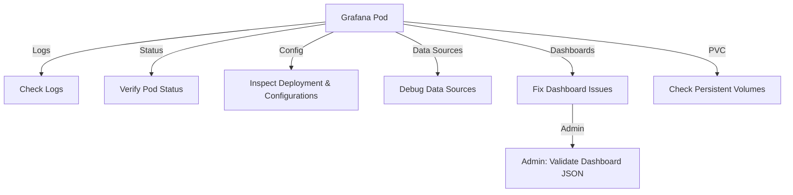

# Journey to Diagnose

## Architectural Diagram



## Terminal
- Commands

## 🚀 Debugging Grafana Bitnami Deployment in Kubernetes

**Namespace:** `grafana-monitoring`

### 1. 🔍 Check Grafana Logs

Start with the Grafana pod logs to find potential errors:

```sh
kubectl get pods -n grafana-monitoring
kubectl logs <grafana-pod-name> -n grafana-monitoring
kubectl logs grafana-7c4977f889-m2bld -n grafana-monitoring
```
```sh
@rifaterdemsahin ➜ /workspaces/grafana-dashboard (main) $ kubectl logs grafana-7c4977f889-m2bld -n grafana-monitoring
grafana 10:29:56.25 INFO  ==> 
grafana 10:29:56.26 INFO  ==> Welcome to the Bitnami grafana container
grafana 10:29:56.26 INFO  ==> Subscribe to project updates by watching https://github.com/bitnami/containers
grafana 10:29:56.26 INFO  ==> Did you know there are enterprise versions of the Bitnami catalog? For enhanced secure software supply chain features, unlimited pulls from Docker, LTS support, or application customization, see Bitnami Premium or Tanzu Application Catalog. See https://www.arrow.com/globalecs/na/vendors/bitnami/ for more information.
grafana 10:29:56.27 INFO  ==> 
grafana 10:29:56.44 INFO  ==> ** Grafana setup finished! **

grafana 10:29:56.52 INFO  ==> ** Starting Grafana **
Error checking server process execution privilege. error: could not get current OS user to detect process privileges
logger=settings t=2025-01-11T10:30:00.475418137Z level=info msg="Starting Grafana" version=11.3.1 commit=b5870186 branch=HEAD compiled=2024-12-04T21:19:30Z
logger=settings t=2025-01-11T10:30:00.475891943Z level=info msg="Config loaded from" file=/opt/bitnami/grafana/conf/defaults.ini
logger=settings t=2025-01-11T10:30:00.475908283Z level=info msg="Config loaded from" file=/opt/bitnami/grafana/conf/grafana.ini
logger=settings t=2025-01-11T10:30:00.475916138Z level=info msg="Config overridden from command line" arg="default.paths.data=/opt/bitnami/grafana/data"
logger=settings t=2025-01-11T10:30:00.475922099Z level=info msg="Config overridden from command line" arg="default.paths.logs=/opt/bitnami/grafana/logs"
logger=settings t=2025-01-11T10:30:00.475928842Z level=info msg="Config overridden from command line" arg="default.paths.plugins=/opt/bitnami/grafana/data/plugins"
logger=settings t=2025-01-11T10:30:00.475934262Z level=info msg="Config overridden from command line" arg="default.paths.provisioning=/opt/bitnami/grafana/conf/provisioning"
logger=settings t=2025-01-11T10:30:00.475940644Z level=info msg="Config overridden from command line" arg="default.log.mode=console"
logger=settings t=2025-01-11T10:30:00.475946615Z level=info msg="Config overridden from Environment variable" var="GF_PATHS_DATA=/opt/bitnami/grafana/data"
logger=settings t=2025-01-11T10:30:00.475951985Z level=info msg="Config overridden from Environment variable" var="GF_PATHS_LOGS=/opt/bitnami/grafana/logs"
logger=settings t=2025-01-11T10:30:00.475969417Z level=info msg="Config overridden from Environment variable" var="GF_PATHS_PLUGINS=/opt/bitnami/grafana/data/plugins"
logger=settings t=2025-01-11T10:30:00.475975268Z level=info msg="Config overridden from Environment variable" var="GF_PATHS_PROVISIONING=/opt/bitnami/grafana/conf/provisioning"
logger=settings t=2025-01-11T10:30:00.475980488Z level=info msg="Config overridden from Environment variable" var="GF_SECURITY_ADMIN_USER=admin"
logger=settings t=2025-01-11T10:30:00.475985327Z level=info msg="Config overridden from Environment variable" var="GF_SECURITY_ADMIN_PASSWORD=*********"
logger=settings t=2025-01-11T10:30:00.475994885Z level=info msg="Config overridden from Environment variable" var="GF_AUTH_LDAP_ENABLED=false"
logger=settings t=2025-01-11T10:30:00.475999904Z level=info msg="Config overridden from Environment variable" var="GF_AUTH_LDAP_CONFIG_FILE=/opt/bitnami/grafana/conf/ldap.toml"
logger=settings t=2025-01-11T10:30:00.476016104Z level=info msg="Config overridden from Environment variable" var="GF_AUTH_LDAP_ALLOW_SIGN_UP=false"
logger=settings t=2025-01-11T10:30:00.476021995Z level=info msg=Target target=[all]
logger=settings t=2025-01-11T10:30:00.476042394Z level=info msg="Path Home" path=/opt/bitnami/grafana
logger=settings t=2025-01-11T10:30:00.476049757Z level=info msg="Path Data" path=/opt/bitnami/grafana/data
logger=settings t=2025-01-11T10:30:00.476057121Z level=info msg="Path Logs" path=/opt/bitnami/grafana/logs
logger=settings t=2025-01-11T10:30:00.47606215Z level=info msg="Path Plugins" path=/opt/bitnami/grafana/data/plugins
logger=settings t=2025-01-11T10:30:00.4760672Z level=info msg="Path Provisioning" path=/opt/bitnami/grafana/conf/provisioning
logger=settings t=2025-01-11T10:30:00.47607251Z level=info msg="App mode production"
logger=featuremgmt t=2025-01-11T10:30:00.486970634Z level=info msg=FeatureToggles lokiMetricDataplane=true lokiQuerySplitting=true cloudWatchRoundUpEndTime=true annotationPermissionUpdate=true cloudWatchCrossAccountQuerying=true alertingSimplifiedRouting=true tlsMemcached=true accessControlOnCall=true kubernetesPlaylists=true dataplaneFrontendFallback=true lokiStructuredMetadata=true dashboardSceneSolo=true logRowsPopoverMenu=true alertingInsights=true influxdbBackendMigration=true dashboardScene=true pinNavItems=true ssoSettingsApi=true dashgpt=true notificationBanner=true lokiQueryHints=true recoveryThreshold=true topnav=true exploreMetrics=true awsAsyncQueryCaching=true cloudWatchNewLabelParsing=true recordedQueriesMulti=true addFieldFromCalculationStatFunctions=true logsExploreTableVisualisation=true publicDashboardsScene=true publicDashboards=true groupToNestedTableTransformation=true prometheusConfigOverhaulAuth=true transformationsVariableSupport=true angularDeprecationUI=true prometheusAzureOverrideAudience=true dashboardSceneForViewers=true managedPluginsInstall=true panelMonitoring=true formatString=true promQLScope=true correlations=true transformationsRedesign=true nestedFolders=true autoMigrateXYChartPanel=true logsInfiniteScrolling=true alertingNoDataErrorExecution=true prometheusMetricEncyclopedia=true openSearchBackendFlowEnabled=true logsContextDatasourceUi=true
logger=sqlstore t=2025-01-11T10:30:00.487096449Z level=info msg="Connecting to DB" dbtype=sqlite3
logger=migrator t=2025-01-11T10:30:00.543230065Z level=info msg="Locking database"
logger=migrator t=2025-01-11T10:30:00.543321746Z level=info msg="Starting DB migrations"
logger=migrator t=2025-01-11T10:30:00.633819458Z level=info msg="migrations completed" performed=0 skipped=611 duration=525.67µs
logger=migrator t=2025-01-11T10:30:00.638306125Z level=info msg="Unlocking database"
logger=secrets t=2025-01-11T10:30:00.640629949Z level=info msg="Envelope encryption state" enabled=true currentprovider=secretKey.v1
logger=plugin.angulardetectorsprovider.dynamic t=2025-01-11T10:30:01.76594731Z level=info msg="Restored cache from database" duration=1.75354ms
logger=plugin.store t=2025-01-11T10:30:01.835929042Z level=info msg="Loading plugins..."
logger=plugins.registration t=2025-01-11T10:30:02.340939859Z level=error msg="Could not register plugin" pluginId=xychart error="plugin xychart is already registered"
logger=plugins.initialization t=2025-01-11T10:30:02.341061686Z level=error msg="Could not initialize plugin" pluginId=xychart error="plugin xychart is already registered"
logger=local.finder t=2025-01-11T10:30:02.341265716Z level=warn msg="Skipping finding plugins as directory does not exist" path=/opt/bitnami/grafana/plugins-bundled
logger=plugins.validator.angular t=2025-01-11T10:30:03.143569794Z level=error msg="Refusing to initialize plugin because it's using Angular, which has been disabled" pluginId=agenty-flowcharting-panel
logger=plugins.validation t=2025-01-11T10:30:03.143595021Z level=error msg="Plugin validation failed" pluginId=agenty-flowcharting-panel error="angular plugins are not supported"
logger=plugins.validator.angular t=2025-01-11T10:30:03.462541961Z level=error msg="Refusing to initialize plugin because it's using Angular, which has been disabled" pluginId=briangann-datatable-panel
logger=plugins.validation t=2025-01-11T10:30:03.462566557Z level=error msg="Plugin validation failed" pluginId=briangann-datatable-panel error="angular plugins are not supported"
logger=plugins.registration t=2025-01-11T10:30:03.573209999Z level=info msg="Plugin registered" pluginId=briangann-gauge-panel
logger=plugins.validator.angular t=2025-01-11T10:30:03.650285913Z level=error msg="Refusing to initialize plugin because it's using Angular, which has been disabled" pluginId=digiapulssi-organisations-panel
logger=plugins.validation t=2025-01-11T10:30:03.650306432Z level=error msg="Plugin validation failed" pluginId=digiapulssi-organisations-panel error="angular plugins are not supported"
logger=plugins.registration t=2025-01-11T10:30:04.042070509Z level=info msg="Plugin registered" pluginId=grafana-clock-panel
logger=plugins.registration t=2025-01-11T10:30:04.347207184Z level=info msg="Plugin registered" pluginId=grafana-lokiexplore-app
logger=plugins.validator.angular t=2025-01-11T10:30:04.450470304Z level=error msg="Refusing to initialize plugin because it's using Angular, which has been disabled" pluginId=grafana-piechart-panel
logger=plugins.validation t=2025-01-11T10:30:04.450499098Z level=error msg="Plugin validation failed" pluginId=grafana-piechart-panel error="angular plugins are not supported"
logger=plugins.registration t=2025-01-11T10:30:04.652173221Z level=info msg="Plugin registered" pluginId=grafana-polystat-panel
logger=plugins.registration t=2025-01-11T10:30:05.246965428Z level=info msg="Plugin registered" pluginId=jdbranham-diagram-panel
logger=plugins.registration t=2025-01-11T10:30:05.434885519Z level=info msg="Plugin registered" pluginId=larona-epict-panel
logger=plugins.validator.angular t=2025-01-11T10:30:05.657719353Z level=error msg="Refusing to initialize plugin because it's using Angular, which has been disabled" pluginId=marcuscalidus-svg-panel
logger=plugins.validation t=2025-01-11T10:30:05.657746033Z level=error msg="Plugin validation failed" pluginId=marcuscalidus-svg-panel error="angular plugins are not supported"
logger=plugins.validator.angular t=2025-01-11T10:30:05.749881811Z level=error msg="Refusing to initialize plugin because it's using Angular, which has been disabled" pluginId=michaeldmoore-annunciator-panel
logger=plugins.validation t=2025-01-11T10:30:05.749906828Z level=error msg="Plugin validation failed" pluginId=michaeldmoore-annunciator-panel error="angular plugins are not supported"
logger=plugins.validator.angular t=2025-01-11T10:30:05.853380429Z level=error msg="Refusing to initialize plugin because it's using Angular, which has been disabled" pluginId=michaeldmoore-multistat-panel
logger=plugins.validation t=2025-01-11T10:30:05.853554804Z level=error msg="Plugin validation failed" pluginId=michaeldmoore-multistat-panel error="angular plugins are not supported"
logger=plugins.validator.angular t=2025-01-11T10:30:06.015912522Z level=error msg="Refusing to initialize plugin because it's using Angular, which has been disabled" pluginId=natel-discrete-panel
logger=plugins.validation t=2025-01-11T10:30:06.015938561Z level=error msg="Plugin validation failed" pluginId=natel-discrete-panel error="angular plugins are not supported"
logger=plugins.validator.angular t=2025-01-11T10:30:06.121423976Z level=error msg="Refusing to initialize plugin because it's using Angular, which has been disabled" pluginId=neocat-cal-heatmap-panel
logger=plugins.validation t=2025-01-11T10:30:06.121445286Z level=error msg="Plugin validation failed" pluginId=neocat-cal-heatmap-panel error="angular plugins are not supported"
logger=plugins.registration t=2025-01-11T10:30:06.5408534Z level=info msg="Plugin registered" pluginId=pierosavi-imageit-panel
logger=plugins.registration t=2025-01-11T10:30:06.657290742Z level=info msg="Plugin registered" pluginId=scadavis-synoptic-panel
logger=plugins.validator.angular t=2025-01-11T10:30:06.746498427Z level=error msg="Refusing to initialize plugin because it's using Angular, which has been disabled" pluginId=snuids-trafficlights-panel
logger=plugins.validation t=2025-01-11T10:30:06.746523003Z level=error msg="Plugin validation failed" pluginId=snuids-trafficlights-panel error="angular plugins are not supported"
logger=plugins.registration t=2025-01-11T10:30:06.842648873Z level=info msg="Plugin registered" pluginId=vonage-status-panel
logger=plugin.store t=2025-01-11T10:30:06.842675994Z level=info msg="Plugins loaded" count=63 duration=5.006749186s
logger=query_data t=2025-01-11T10:30:06.965463668Z level=info msg="Query Service initialization"
logger=live.push_http t=2025-01-11T10:30:07.02641641Z level=info msg="Live Push Gateway initialization"
logger=ngalert.notifier.alertmanager org=1 t=2025-01-11T10:30:07.085024902Z level=info msg="Applying new configuration to Alertmanager" configHash=d2c56faca6af2a5772ff4253222f7386
logger=ngalert.state.manager t=2025-01-11T10:30:07.220770901Z level=info msg="Running in alternative execution of Error/NoData mode"
logger=infra.usagestats.collector t=2025-01-11T10:30:07.24341878Z level=info msg="registering usage stat providers" usageStatsProvidersLen=2
logger=server t=2025-01-11T10:30:07.246924949Z level=info msg="Writing PID file" path=/opt/bitnami/grafana/tmp/grafana.pid pid=1
logger=provisioning.alerting t=2025-01-11T10:30:07.258994408Z level=info msg="starting to provision alerting"
logger=provisioning.alerting t=2025-01-11T10:30:07.259032319Z level=info msg="finished to provision alerting"
logger=ngalert.state.manager t=2025-01-11T10:30:07.266120227Z level=info msg="Warming state cache for startup"
logger=http.server t=2025-01-11T10:30:07.271202564Z level=info msg="HTTP Server Listen" address=[::]:3000 protocol=http subUrl= socket=
logger=ngalert.state.manager t=2025-01-11T10:30:07.277572535Z level=info msg="State cache has been initialized" states=0 duration=11.451416ms
logger=grafanaStorageLogger t=2025-01-11T10:30:07.27765018Z level=info msg="Storage starting"
logger=ngalert.multiorg.alertmanager t=2025-01-11T10:30:07.36340586Z level=info msg="Starting MultiOrg Alertmanager"
logger=ngalert.scheduler t=2025-01-11T10:30:07.363665404Z level=info msg="Starting scheduler" tickInterval=10s maxAttempts=1
logger=ticker t=2025-01-11T10:30:07.3660064Z level=info msg=starting first_tick=2025-01-11T10:30:10Z
logger=provisioning.dashboard t=2025-01-11T10:30:07.543350477Z level=info msg="starting to provision dashboards"
logger=provisioning.dashboard t=2025-01-11T10:30:07.543579164Z level=info msg="finished to provision dashboards"
logger=grafana-apiserver t=2025-01-11T10:30:08.746472387Z level=info msg="failed to read in-cluster kubeconfig for delegated authentication: open /var/run/secrets/kubernetes.io/serviceaccount/token: no such file or directory"
logger=grafana-apiserver t=2025-01-11T10:30:08.81538285Z level=info msg="Adding GroupVersion playlist.grafana.app v0alpha1 to ResourceManager"
logger=grafana-apiserver t=2025-01-11T10:30:08.815981047Z level=info msg="Adding GroupVersion featuretoggle.grafana.app v0alpha1 to ResourceManager"
logger=grafana-apiserver t=2025-01-11T10:30:08.817876059Z level=info msg="Adding GroupVersion iam.grafana.app v0alpha1 to ResourceManager"
logger=grafana.update.checker t=2025-01-11T10:30:17.438348825Z level=error msg="Update check failed" error="failed to get stable version from grafana.com: Get \"https://grafana.com/api/grafana/versions/stable\": dial tcp: lookup grafana.com: i/o timeout" duration=10.119313384s
logger=infra.usagestats t=2025-01-11T10:30:50.410528653Z level=info msg="Usage stats are ready to report"
@rifaterdemsahin ➜ /workspaces/grafana-dashboard (main) $ 
```
Analyse
The logs provided indicate the startup process of a Grafana container deployed in the Kubernetes namespace `grafana-monitoring`. Here's an analysis:

### Key Observations:
1. **Initialization**:
   - The Grafana container is a **Bitnami Grafana container**, which is well-supported and frequently updated.
   - Informational messages (`INFO`) confirm that the container setup is completed successfully:  
     ```
     grafana 10:29:56.44 INFO  ==> ** Grafana setup finished! **
     ```

2. **Error on Process Privileges**:
   - An error occurs:  
     ```
     Error checking server process execution privilege. error: could not get current OS user to detect process privileges
     ```
   - This indicates a potential issue with permissions related to identifying the current OS user or process privileges. This error might not block Grafana entirely but should be investigated to ensure functionality isn't compromised.

3. **Configurations Loaded**:
   - Grafana is using the default configuration files (`defaults.ini` and `grafana.ini`) and additional command-line overrides.
   - Environment variables (e.g., `GF_SECURITY_ADMIN_USER`, `GF_SECURITY_ADMIN_PASSWORD`) are also being applied correctly.

4. **Paths and Environment**:
   - Key paths (`data`, `logs`, `plugins`, `provisioning`) are set correctly to the `/opt/bitnami/grafana` directory.
   - The app is running in **production mode**, ensuring it is optimized for stability and performance.

5. **Feature Toggles**:
   - Several advanced features are enabled, such as:
     - `lokiMetricDataplane`
     - `cloudWatchCrossAccountQuerying`
     - `alertingSimplifiedRouting`
   - These suggest integrations with observability tools like Loki and AWS CloudWatch.

---

### Recommended Actions:
1. **Resolve Process Privileges Error**:
   - Investigate why Grafana cannot identify the current OS user:
     - Ensure the container runs with sufficient privileges.
     - Check Kubernetes pod security policies (PSPs) or PodSecurity admission settings.
     - Confirm that the Grafana container's service account has appropriate permissions.

2. **Verify Environment Variables**:
   - Ensure sensitive variables like `GF_SECURITY_ADMIN_PASSWORD` are securely stored and rotated when necessary.

3. **Confirm Feature Compatibility**:
   - Verify that the enabled feature toggles align with your deployment requirements. For instance:
     - Ensure Loki and CloudWatch are properly integrated and configured.

4. **Monitor Logs for Further Errors**:
   - Keep an eye on Grafana logs (`/opt/bitnami/grafana/logs`) for additional warnings or errors that may arise post-startup.

5. **Document Configurations**:
   - Note the configurations loaded from the command line and environment variables for reference in case of troubleshooting or replication needs.

Let me know if you'd like assistance with resolving the process privileges error or configuring integrations.

Look for:
- ⚠️ errors
- 🔑 issues
- ❌ Data source connection

### 2. 🐳 Verify Pod Status

🔄 Check if the pod is running:

```sh
kubectl get pods -n grafana-monitoring
```

If the pod isn’t running:

```sh
kubectl describe pod <grafana-pod-name> -n grafana-monitoring
```

🔧 Restart the pod if needed:

```sh
kubectl delete pod <grafana-pod-name> -n grafana-monitoring
```

### 3. ⚙️ Inspect Deployment & Configurations

🔍 Check the deployment:

```sh
kubectl describe deployment grafana -n grafana-monitoring
```

📋 Review ConfigMap:

Ensure settings for dashboards, data sources, and environment variables are correct:

```sh
kubectl describe configmap <grafana-configmap-name> -n grafana-monitoring
```

💾 Check Persistent Volumes:

Ensure persistent storage is properly mounted:

```sh
kubectl get pvc -n grafana-monitoring
```

### 4. 🔗 Debug Data Sources

✅ Test data source connections:
1. Open Grafana UI
2. Navigate to Configuration > Data Sources
3. Test the connection status

🛠️ Fix connection issues:
- Check credentials 🗝️
- Verify network access 🔌
- Ensure the service is correctly configured in Kubernetes:

```sh
kubectl get svc -n grafana-monitoring
```

### 5. 📊 Fix Dashboard Issues

🛠️ Validate dashboard JSON files:
- Test importing your JSON files via the Grafana UI.
- Ensure JSON structure is valid.

🔐 Check permissions:
- Verify folder permissions in the UI.
- Check Kubernetes RBAC policies.

### 6. 🧩 Debug Plugins

📦 Verify installed plugins:

```sh
kubectl logs <grafana-pod-name> -n grafana-monitoring
```

## 🎨 Steps to Visualize in draw.io

### 1. Set the Diagram Layout
- Use a flowchart template to organize components systematically.
- Create swimlanes for each aspect of the deployment:
    - Kubernetes Cluster
    - Grafana Configuration
    - Data Sources
    - Monitoring and Debugging Tools

### 2. Add Key Components
For each component, use appropriate shapes and labels:
- Pods: Rounded rectangles or circles (e.g., “Grafana Pod”, “Data Source Pod”).
- Deployments: Use rectangles labeled “Bitnami Deployment”.
- ConfigMaps: Use document icons or smaller rectangles.
- Persistent Volumes: Use a cylinder shape labeled “PVC”.
- Network Services: Use a cloud or box labeled “Service” or “Ingress”.
- Dashboards: Use a monitor icon or simple rectangles with “Dashboard”.

### 3. Illustrate Debugging Flow
Represent the debugging tools and processes with arrows:
- Arrows pointing from pod to logs: “kubectl logs”.
- Arrows showing connections to ConfigMaps or Persistent Volumes.
- Highlight workflows, e.g., “Test Data Sources ➡️ Fix Network Issues”.

### 4. Group by Layers
Separate the diagram into layers:
- Kubernetes Cluster: Pods, Deployments, ConfigMaps, PVCs.
- Data Flow: Data sources connecting to Grafana.
- Debugging Tools: Highlight key kubectl commands and areas to investigate.

### 5. Add Color Coding and Icons
- Red: Error points or issues (e.g., broken connections).
- Green: Healthy components (e.g., active data sources).
- Use standard cloud/Kubernetes icons for clarity (e.g., from AWS/GCP icon sets).

## 🔧 Example Visualization Components

| Component          | Shape/Icon         | Label/Details                  |
|--------------------|--------------------|--------------------------------|
| Grafana Pod        | Rounded rectangle  | Grafana Pod                    |
| Data Source        | Circle             | Prometheus / Loki              |
| ConfigMap          | Document icon      | ConfigMap: grafana-config      |
| Persistent Volume  | Cylinder           | PVC: grafana-pvc               |
| Debugging Command  | Arrow/Connector    | E.g., kubectl logs or describe |
| Dashboards         | Monitor icon       | Custom Dashboard: System Health|

## 🛠️ How to Add These in draw.io
1. Drag and Drop Shapes
     - Use the basic shapes or Kubernetes library for standard symbols.
2. Customize Text and Colors
     - Right-click on shapes to edit text.
     - Use the toolbar for color coding (red, green, etc.).
3. Connect Components
     - Use arrows to illustrate data flow and debugging paths (drag arrows from the connection points of shapes).
4. Export Your Diagram
     - Save as PNG, SVG, or PDF for easy sharing and integration into documentation.
