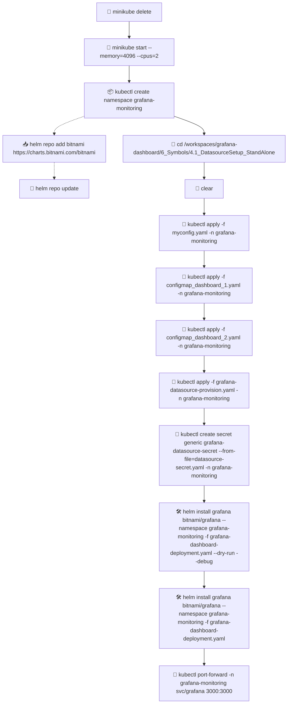

```mermaid
graph TD
    A[🚜 minikube delete]
    B[🚀 minikube start --memory=4096 --cpus=2]
    C[📦 kubectl create namespace grafana-monitoring]
    D[📥 helm repo add bitnami https://charts.bitnami.com/bitnami]
    E[🔄 helm repo update]
    F[📂 cd /workspaces/grafana-dashboard/6_Symbols/4.1_DatasourceSetup_StandAlone]
    G[🧹 clear]
    H[📄 kubectl apply -f myconfig.yaml -n grafana-monitoring]
    I[📄 kubectl apply -f configmap_dashboard_1.yaml -n grafana-monitoring]
    J[📄 kubectl apply -f configmap_dashboard_2.yaml -n grafana-monitoring]
    K[📄 kubectl apply -f grafana-datasource-provision.yaml -n grafana-monitoring]
    L[🔐 kubectl create secret generic grafana-datasource-secret --from-file=datasource-secret.yaml -n grafana-monitoring]
    M[🛠️ helm install grafana bitnami/grafana --namespace grafana-monitoring -f grafana-dashboard-deployment.yaml --dry-run --debug]
    N[🛠️ helm install grafana bitnami/grafana --namespace grafana-monitoring -f grafana-dashboard-deployment.yaml]
    O[🔌 kubectl port-forward -n grafana-monitoring svc/grafana 3000:3000]

    A --> B
    B --> C
    C --> F
    F --> G
    G --> H
    H --> I
    I --> J
    J --> K
    K --> L
    L --> M
    M --> N
    N --> O

    C -.-> D
    D -.-> E
```