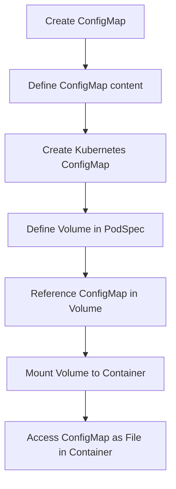

It sounds like there might be an issue with the ConfigMap or the way it's being mounted. Here are a few steps you can try to troubleshoot this:

1. **Verify ConfigMap**: Ensure that the ConfigMap is correctly created and contains the expected data. You can check this by running:
   ```sh
   kubectl get configmap grafana-dashboard-config -o yaml -n grafana-monitoring
   ```

rifaterdemsahin ➜ /workspaces/grafana-dashboard/6_Symbols/2_Grafana (main) $ kubectl get configmap grafana-dashboard-config -o yaml -n grafana-monitoring
apiVersion: v1
data:
  sample-dashboard.json: |
    {
      "dashboard": {
        "id": null,
        "uid": null,
        "title": "Sample Dashboard",
        "tags": [],
        "timezone": "browser",
        "schemaVersion": 16,
        "version": 0,
        "refresh": "5s",
        "panels": [
          {
            "type": "graph",
            "title": "Sample Graph",
            "gridPos": {
              "x": 0,
              "y": 0,
              "w": 24,
              "h": 9
            },
            "id": 1,
            "datasource": null,
            "targets": [
              {
                "target": "sample.metric",
                "refId": "A"
              }
            ],
            "lines": true,
            "linewidth": 1,
            "nullPointMode": "null"
          }
        ]
      },
      "overwrite": false
    }
kind: ConfigMap
metadata:
  annotations:
    kubectl.kubernetes.io/last-applied-configuration: |
      {"apiVersion":"v1","data":{"sample-dashboard.json":"{\n  \"dashboard\": {\n    \"id\": null,\n    \"uid\": null,\n    \"title\": \"Sample Dashboard\",\n    \"tags\": [],\n    \"timezone\": \"browser\",\n    \"schemaVersion\": 16,\n    \"version\": 0,\n    \"refresh\": \"5s\",\n    \"panels\": [\n      {\n        \"type\": \"graph\",\n        \"title\": \"Sample Graph\",\n        \"gridPos\": {\n          \"x\": 0,\n          \"y\": 0,\n          \"w\": 24,\n          \"h\": 9\n        },\n        \"id\": 1,\n        \"datasource\": null,\n        \"targets\": [\n          {\n            \"target\": \"sample.metric\",\n            \"refId\": \"A\"\n          }\n        ],\n        \"lines\": true,\n        \"linewidth\": 1,\n        \"nullPointMode\": \"null\"\n      }\n    ]\n  },\n  \"overwrite\": false\n}\n"},"kind":"ConfigMap","metadata":{"annotations":{},"labels":{"grafana_dashboard":"1"},"name":"grafana-dashboard-config","namespace":"grafana-monitoring"}}
  creationTimestamp: "2025-01-09T11:21:23Z"
  labels:
    grafana_dashboard: "1"
  name: grafana-dashboard-config
  namespace: grafana-monitoring
  resourceVersion: "10743"
  uid: 2a14a3da-c5f6-4c0d-89d3-fa029fceee20
@rifaterdemsahin ➜ /workspaces/grafana-dashboard/6_Symbols/2_Grafana (main) $ ^C
@rifaterdemsahin ➜ /workspaces/grafana-dashboard/6_Symbols/2_Grafana (main) $ 


Thanks for sharing the output. It looks like the ConfigMap is correctly created and contains the expected data. Let's try a few more steps to troubleshoot:

1. **Check Grafana Logs**: Look for any errors related to loading dashboards.
   ```sh
@rifaterdemsahin ➜ /workspaces/grafana-dashboard/6_Symbols/2_Grafana (main) $ kubectl get pod -n grafana-monitoring
NAME                       READY   STATUS    RESTARTS   AGE
grafana-6b7b4d564b-pslwj   1/1     Running   0          3m25s
   kubectl logs -n grafana-monitoring <grafana-pod-name>
   kubectl logs -n grafana-monitoring grafana-6b7b4d564b-pslwj


   ```


   grafana 11:35:23.73 INFO  ==> ** Starting Grafana **
Error checking server process execution privilege. error: could not get current OS user to detect process privileges
logger=settings t=2025-01-09T11:35:24.543316858Z level=info msg="Starting Grafana" version=11.3.1 commit=b5870186 branch=HEAD compiled=2024-12-04T21:19:30Z
logger=settings t=2025-01-09T11:35:24.543661341Z level=info msg="Config loaded from" file=/opt/bitnami/grafana/conf/defaults.ini
logger=settings t=2025-01-09T11:35:24.543676609Z level=info msg="Config loaded from" file=/opt/bitnami/grafana/conf/grafana.ini
logger=settings t=2025-01-09T11:35:24.543683132Z level=info msg="Config overridden from command line" arg="default.paths.data=/opt/bitnami/grafana/data"
logger=settings t=2025-01-09T11:35:24.543688722Z level=info msg="Config overridden from command line" arg="default.paths.logs=/opt/bitnami/grafana/logs"
logger=settings t=2025-01-09T11:35:24.543695335Z level=info msg="Config overridden from command line" arg="default.paths.plugins=/opt/bitnami/grafana/data/plugins"
logger=settings t=2025-01-09T11:35:24.543700865Z level=info msg="Config overridden from command line" arg="default.paths.provisioning=/opt/bitnami/grafana/conf/provisioning"
logger=settings t=2025-01-09T11:35:24.543706946Z level=info msg="Config overridden from command line" arg="default.log.mode=console"
logger=settings t=2025-01-09T11:35:24.543732614Z level=info msg="Config overridden from Environment variable" var="GF_PATHS_DATA=/opt/bitnami/grafana/data"
logger=settings t=2025-01-09T11:35:24.543739186Z level=info msg="Config overridden from Environment variable" var="GF_PATHS_LOGS=/opt/bitnami/grafana/logs"
logger=settings t=2025-01-09T11:35:24.543744556Z level=info msg="Config overridden from Environment variable" var="GF_PATHS_PLUGINS=/opt/bitnami/grafana/data/plugins"
logger=settings t=2025-01-09T11:35:24.543750047Z level=info msg="Config overridden from Environment variable" var="GF_PATHS_PROVISIONING=/opt/bitnami/grafana/conf/provisioning"
logger=settings t=2025-01-09T11:35:24.543755006Z level=info msg="Config overridden from Environment variable" var="GF_SECURITY_ADMIN_USER=admin"
logger=settings t=2025-01-09T11:35:24.543760236Z level=info msg="Config overridden from Environment variable" var="GF_SECURITY_ADMIN_PASSWORD=*********"
logger=settings t=2025-01-09T11:35:24.543765666Z level=info msg="Config overridden from Environment variable" var="GF_AUTH_LDAP_ENABLED=false"
logger=settings t=2025-01-09T11:35:24.543770976Z level=info msg="Config overridden from Environment variable" var="GF_AUTH_LDAP_CONFIG_FILE=/opt/bitnami/grafana/conf/ldap.toml"
logger=settings t=2025-01-09T11:35:24.543776606Z level=info msg="Config overridden from Environment variable" var="GF_AUTH_LDAP_ALLOW_SIGN_UP=false"
logger=settings t=2025-01-09T11:35:24.543781906Z level=info msg=Target target=[all]
logger=settings t=2025-01-09T11:35:24.543824155Z level=info msg="Path Home" path=/opt/bitnami/grafana
logger=settings t=2025-01-09T11:35:24.543830607Z level=info msg="Path Data" path=/opt/bitnami/grafana/data
logger=settings t=2025-01-09T11:35:24.543836077Z level=info msg="Path Logs" path=/opt/bitnami/grafana/logs
logger=settings t=2025-01-09T11:35:24.543840996Z level=info msg="Path Plugins" path=/opt/bitnami/grafana/data/plugins
logger=settings t=2025-01-09T11:35:24.543845615Z level=info msg="Path Provisioning" path=/opt/bitnami/grafana/conf/provisioning
logger=settings t=2025-01-09T11:35:24.543850444Z level=info msg="App mode production"
logger=featuremgmt t=2025-01-09T11:35:24.544204505Z level=info msg=FeatureToggles alertingInsights=true promQLScope=true transformationsRedesign=true dashboardSceneSolo=true kubernetesPlaylists=true exploreMetrics=true pinNavItems=true lokiQuerySplitting=true notificationBanner=true logsInfiniteScrolling=true prometheusAzureOverrideAudience=true transformationsVariableSupport=true panelMonitoring=true groupToNestedTableTransformation=true alertingSimplifiedRouting=true cloudWatchNewLabelParsing=true prometheusConfigOverhaulAuth=true logRowsPopoverMenu=true autoMigrateXYChartPanel=true openSearchBackendFlowEnabled=true dashboardScene=true managedPluginsInstall=true addFieldFromCalculationStatFunctions=true alertingNoDataErrorExecution=true ssoSettingsApi=true influxdbBackendMigration=true correlations=true angularDeprecationUI=true recordedQueriesMulti=true lokiQueryHints=true topnav=true tlsMemcached=true prometheusMetricEncyclopedia=true nestedFolders=true formatString=true dataplaneFrontendFallback=true recoveryThreshold=true publicDashboards=true annotationPermissionUpdate=true lokiMetricDataplane=true cloudWatchCrossAccountQuerying=true cloudWatchRoundUpEndTime=true lokiStructuredMetadata=true awsAsyncQueryCaching=true logsExploreTableVisualisation=true dashgpt=true dashboardSceneForViewers=true accessControlOnCall=true logsContextDatasourceUi=true publicDashboardsScene=true
logger=sqlstore t=2025-01-09T11:35:24.544272061Z level=info msg="Connecting to DB" dbtype=sqlite3
logger=migrator t=2025-01-09T11:35:24.545885113Z level=info msg="Locking database"
logger=migrator t=2025-01-09T11:35:24.545903839Z level=info msg="Starting DB migrations"
logger=migrator t=2025-01-09T11:35:24.63610439Z level=info msg="migrations completed" performed=0 skipped=611 duration=458.236µs
logger=migrator t=2025-01-09T11:35:24.636305946Z level=info msg="Unlocking database"
logger=secrets t=2025-01-09T11:35:24.637119415Z level=info msg="Envelope encryption state" enabled=true currentprovider=secretKey.v1
logger=plugin.angulardetectorsprovider.dynamic t=2025-01-09T11:35:25.135213174Z level=info msg="Restored cache from database" duration=265.115µs
logger=plugin.store t=2025-01-09T11:35:25.136413453Z level=info msg="Loading plugins..."
logger=plugins.registration t=2025-01-09T11:35:25.443228033Z level=error msg="Could not register plugin" pluginId=xychart error="plugin xychart is already registered"
logger=plugins.initialization t=2025-01-09T11:35:25.443253229Z level=error msg="Could not initialize plugin" pluginId=xychart error="plugin xychart is already registered"
logger=local.finder t=2025-01-09T11:35:25.443406967Z level=warn msg="Skipping finding plugins as directory does not exist" path=/opt/bitnami/grafana/plugins-bundled
logger=plugins.validator.angular t=2025-01-09T11:35:26.146020029Z level=error msg="Refusing to initialize plugin because it's using Angular, which has been disabled" pluginId=agenty-flowcharting-panel
logger=plugins.validation t=2025-01-09T11:35:26.146046208Z level=error msg="Plugin validation failed" pluginId=agenty-flowcharting-panel error="angular plugins are not supported"
logger=plugins.validator.angular t=2025-01-09T11:35:26.332821908Z level=error msg="Refusing to initialize plugin because it's using Angular, which has been disabled" pluginId=briangann-datatable-panel
logger=plugins.validation t=2025-01-09T11:35:26.333063379Z level=error msg="Plugin validation failed" pluginId=briangann-datatable-panel error="angular plugins are not supported"
logger=plugins.registration t=2025-01-09T11:35:26.439528809Z level=info msg="Plugin registered" pluginId=briangann-gauge-panel
logger=plugins.validator.angular t=2025-01-09T11:35:26.530929519Z level=error msg="Refusing to initialize plugin because it's using Angular, which has been disabled" pluginId=digiapulssi-organisations-panel
logger=plugins.validation t=2025-01-09T11:35:26.530952622Z level=error msg="Plugin validation failed" pluginId=digiapulssi-organisations-panel error="angular plugins are not supported"
logger=plugins.registration t=2025-01-09T11:35:26.734900068Z level=info msg="Plugin registered" pluginId=grafana-clock-panel
logger=plugins.registration t=2025-01-09T11:35:26.953970233Z level=info msg="Plugin registered" pluginId=grafana-lokiexplore-app
logger=plugins.validator.angular t=2025-01-09T11:35:27.03624357Z level=error msg="Refusing to initialize plugin because it's using Angular, which has been disabled" pluginId=grafana-piechart-panel
logger=plugins.validation t=2025-01-09T11:35:27.036267054Z level=error msg="Plugin validation failed" pluginId=grafana-piechart-panel error="angular plugins are not supported"
logger=plugins.registration t=2025-01-09T11:35:27.147253176Z level=info msg="Plugin registered" pluginId=grafana-polystat-panel
logger=plugins.registration t=2025-01-09T11:35:27.834033574Z level=info msg="Plugin registered" pluginId=jdbranham-diagram-panel
logger=plugins.registration t=2025-01-09T11:35:27.94048025Z level=info msg="Plugin registered" pluginId=larona-epict-panel
logger=plugins.validator.angular t=2025-01-09T11:35:28.143785639Z level=error msg="Refusing to initialize plugin because it's using Angular, which has been disabled" pluginId=marcuscalidus-svg-panel
logger=plugins.validation t=2025-01-09T11:35:28.14381316Z level=error msg="Plugin validation failed" pluginId=marcuscalidus-svg-panel error="angular plugins are not supported"
logger=plugins.validator.angular t=2025-01-09T11:35:28.277013302Z level=error msg="Refusing to initialize plugin because it's using Angular, which has been disabled" pluginId=michaeldmoore-annunciator-panel
logger=plugins.validation t=2025-01-09T11:35:28.277039931Z level=error msg="Plugin validation failed" pluginId=michaeldmoore-annunciator-panel error="angular plugins are not supported"
logger=plugins.validator.angular t=2025-01-09T11:35:28.36322359Z level=error msg="Refusing to initialize plugin because it's using Angular, which has been disabled" pluginId=michaeldmoore-multistat-panel
logger=plugins.validation t=2025-01-09T11:35:28.363247435Z level=error msg="Plugin validation failed" pluginId=michaeldmoore-multistat-panel error="angular plugins are not supported"
logger=plugins.validator.angular t=2025-01-09T11:35:28.436748299Z level=error msg="Refusing to initialize plugin because it's using Angular, which has been disabled" pluginId=natel-discrete-panel
logger=plugins.validation t=2025-01-09T11:35:28.436774769Z level=error msg="Plugin validation failed" pluginId=natel-discrete-panel error="angular plugins are not supported"
logger=plugins.validator.angular t=2025-01-09T11:35:28.543860838Z level=error msg="Refusing to initialize plugin because it's using Angular, which has been disabled" pluginId=neocat-cal-heatmap-panel
logger=plugins.validation t=2025-01-09T11:35:28.543892597Z level=error msg="Plugin validation failed" pluginId=neocat-cal-heatmap-panel error="angular plugins are not supported"
logger=plugins.registration t=2025-01-09T11:35:28.935470854Z level=info msg="Plugin registered" pluginId=pierosavi-imageit-panel
logger=plugins.registration t=2025-01-09T11:35:29.039961485Z level=info msg="Plugin registered" pluginId=scadavis-synoptic-panel
logger=plugins.validator.angular t=2025-01-09T11:35:29.13414303Z level=error msg="Refusing to initialize plugin because it's using Angular, which has been disabled" pluginId=snuids-trafficlights-panel
logger=plugins.validation t=2025-01-09T11:35:29.134166423Z level=error msg="Plugin validation failed" pluginId=snuids-trafficlights-panel error="angular plugins are not supported"
logger=plugins.registration t=2025-01-09T11:35:29.232242328Z level=info msg="Plugin registered" pluginId=vonage-status-panel
logger=plugin.store t=2025-01-09T11:35:29.232272064Z level=info msg="Plugins loaded" count=63 duration=4.095857018s
logger=query_data t=2025-01-09T11:35:29.241546319Z level=info msg="Query Service initialization"
logger=live.push_http t=2025-01-09T11:35:29.430886018Z level=info msg="Live Push Gateway initialization"
logger=ngalert.notifier.alertmanager org=1 t=2025-01-09T11:35:29.436022923Z level=info msg="Applying new configuration to Alertmanager" configHash=d2c56faca6af2a5772ff4253222f7386
logger=ngalert.state.manager t=2025-01-09T11:35:29.531081994Z level=info msg="Running in alternative execution of Error/NoData mode"
logger=infra.usagestats.collector t=2025-01-09T11:35:29.533276071Z level=info msg="registering usage stat providers" usageStatsProvidersLen=2
logger=server t=2025-01-09T11:35:29.533535263Z level=info msg="Writing PID file" path=/opt/bitnami/grafana/tmp/grafana.pid pid=1
logger=provisioning.alerting t=2025-01-09T11:35:29.534962991Z level=info msg="starting to provision alerting"
logger=provisioning.alerting t=2025-01-09T11:35:29.534987927Z level=info msg="finished to provision alerting"
logger=provisioning.dashboard t=2025-01-09T11:35:29.535489342Z level=info msg="starting to provision dashboards"
logger=provisioning.dashboard t=2025-01-09T11:35:29.53569184Z level=info msg="finished to provision dashboards"
logger=grafanaStorageLogger t=2025-01-09T11:35:29.53617287Z level=info msg="Storage starting"
logger=http.server t=2025-01-09T11:35:29.540095593Z level=info msg="HTTP Server Listen" address=[::]:3000 protocol=http subUrl= socket=
logger=ngalert.state.manager t=2025-01-09T11:35:29.540304894Z level=info msg="Warming state cache for startup"
logger=ngalert.state.manager t=2025-01-09T11:35:29.540552105Z level=info msg="State cache has been initialized" states=0 duration=246.25µs
logger=ngalert.multiorg.alertmanager t=2025-01-09T11:35:29.730110285Z level=info msg="Starting MultiOrg Alertmanager"
logger=ngalert.scheduler t=2025-01-09T11:35:29.730215341Z level=info msg="Starting scheduler" tickInterval=10s maxAttempts=1
logger=ticker t=2025-01-09T11:35:29.730319405Z level=info msg=starting first_tick=2025-01-09T11:35:30Z
logger=plugins.update.checker t=2025-01-09T11:35:30.329334031Z level=info msg="Update check succeeded" duration=793.547783ms
logger=grafana.update.checker t=2025-01-09T11:35:30.329797106Z level=info msg="Update check succeeded" duration=794.61218ms
logger=grafana-apiserver t=2025-01-09T11:35:31.935844678Z level=info msg="failed to read in-cluster kubeconfig for delegated authentication: open /var/run/secrets/kubernetes.io/serviceaccount/token: no such file or directory"
logger=grafana-apiserver t=2025-01-09T11:35:31.94072879Z level=info msg="Adding GroupVersion playlist.grafana.app v0alpha1 to ResourceManager"
logger=grafana-apiserver t=2025-01-09T11:35:31.941195672Z level=info msg="Adding GroupVersion featuretoggle.grafana.app v0alpha1 to ResourceManager"
logger=grafana-apiserver t=2025-01-09T11:35:31.942252505Z level=info msg="Adding GroupVersion iam.grafana.app v0alpha1 to ResourceManager"
logger=context userId=1 orgId=1 uname=admin t=2025-01-09T11:35:35.523536471Z level=info msg="Request Completed" method=GET path=/api/live/ws status=-1 remote_addr=10.240.1.34 time_ms=1 duration=1.533423ms size=0 referer= handler=/api/live/ws status_source=server
logger=infra.usagestats t=2025-01-09T11:37:23.538316297Z level=info msg="Usage stats are ready to report"
@rifaterdemsahin ➜ /workspaces/grafana-dashboard/6_Symbols/2_Grafana (main) $ 


2. **Verify Volume Mounts**: Ensure the ConfigMap is correctly mounted in the Grafana pod. You can describe the pod to check the volume mounts.
   ```sh
   kubectl describe pod -n grafana-monitoring <grafana-pod-name>
   ```

3. **Check Grafana Configuration**: Ensure Grafana is configured to load dashboards from the specified directory. You can check the Grafana configuration file or environment variables.

4. **Reload Dashboards**: Sometimes, manually reloading the dashboards in Grafana can help. You can do this through the Grafana UI or by using the Grafana API.

5. **Permissions**: Double-check the permissions on the mounted directory. The `init-chmod-data` container should set the correct permissions, but it's good to verify.

If you still encounter issues, please share any relevant logs or error messages, and we can continue troubleshooting.

2. **Check Volume Mounts**: Make sure the volume mounts are correctly set up in your Grafana deployment. The `grafana-dashboard-config` should be mounted to the correct path.

3. **Pod Logs**: Check the logs of the Grafana pod to see if there are any errors related to loading the dashboards:
   ```sh
   kubectl logs <grafana-pod-name>
   ```

4. **Delete and Recreate Pods**: Sometimes, deleting the pods can help in reloading the configurations. You can delete the Grafana pod, and it will be recreated automatically:
   ```sh
   kubectl delete pod <grafana-pod-name>
   ```

5. **Permissions**: Ensure that the permissions are correctly set for the directories where the dashboards are being mounted. The `init-chmod-data` container should handle this, but it's good to double-check.

6. **Grafana UI**: After logging into Grafana, go to the "Dashboards" section and check if the dashboard appears under "Manage" or "Browse".

If you've tried these steps and are still facing issues, please share any error messages or logs you see, and we can dig deeper into the problem.
Here are some detailed steps to troubleshoot the ConfigMap issue with Grafana:

1. **Verify ConfigMap**: Ensure that the ConfigMap is correctly created and contains the expected data. You can check this by running:
  ```sh
  kubectl get configmap grafana-dashboard-config -o yaml -n grafana-monitoring
  ```
  If the ConfigMap looks correct, proceed to the next steps.

2. **Check Grafana Logs**: Look for any errors related to loading dashboards. First, get the pod name:
  ```sh
  kubectl get pod -n grafana-monitoring
  ```
  Then, check the logs:
  ```sh
  kubectl logs -n grafana-monitoring <grafana-pod-name>
  ```
  Example:
  ```sh
  kubectl logs -n grafana-monitoring grafana-6b7b4d564b-pslwj
  ```

3. **Verify Volume Mounts**: Ensure the ConfigMap is correctly mounted in the Grafana pod. Describe the pod to check the volume mounts:
  ```sh
  kubectl describe pod -n grafana-monitoring <grafana-pod-name>
  ```

4. **Check Grafana Configuration**: Ensure Grafana is configured to load dashboards from the specified directory. Check the Grafana configuration file or environment variables.

5. **Reload Dashboards**: Sometimes, manually reloading the dashboards in Grafana can help. You can do this through the Grafana UI or by using the Grafana API.

6. **Permissions**: Double-check the permissions on the mounted directory. The `init-chmod-data` container should set the correct permissions, but it's good to verify.

7. **Delete and Recreate Pods**: Sometimes, deleting the pods can help in reloading the configurations. You can delete the Grafana pod, and it will be recreated automatically:
  ```sh
  kubectl delete pod <grafana-pod-name>
  ```

8. **Grafana UI**: After logging into Grafana, go to the "Dashboards" section and check if the dashboard appears under "Manage" or "Browse".

If you still encounter issues, please share any relevant logs or error messages, and we can continue troubleshooting.


rationale: configmap > create a file >> place in a volume >>> and mount it with a volume mount


Here's a Mermaid diagram that visually explains the rationale for creating a ConfigMap, placing it in a volume, and mounting it with a volume mount:



### Steps Explanation:
1. **Create ConfigMap**: Define key-value pairs or files in the ConfigMap.
2. **Define Volume**: In the Pod specification, declare a volume referencing the ConfigMap.
3. **Mount Volume**: Attach the volume to a container's file system path.
4. **Access ConfigMap**: The container accesses the ConfigMap data as files.